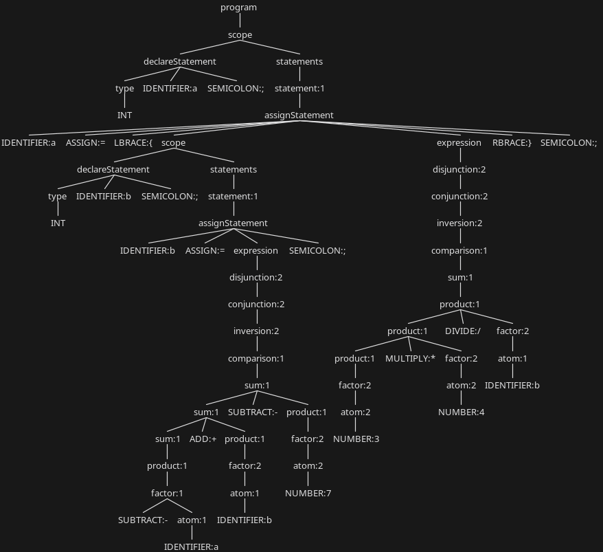

# INFOM227 ExampleAnalyser

The aim of this project is to provide an example of a static code analyser and to remind people of the basics of creating languages.

The analyser has been implemented in [Scala](https://www.scala-lang.org/) for several reasons:

- Scala natively supports Java libraries, including [ANTLR](https://www.antlr.org/), which is one of the best-known libraries for writing programming languages.
- Scala supports [Algebraic data type](https://en.wikipedia.org/wiki/Algebraic_data_type) and has powerful [Pattern matching](https://en.wikipedia.org/wiki/Pattern_matching) capabilities, which makes it very easy to define a language and perform analysis on it.
- It provides a very good developer experience because there is a built-in [Gradle plugin for Scala](https://docs.gradle.org/current/userguide/scala_plugin.html) and [Gradle plugin for ANTLR](https://docs.gradle.org/current/userguide/antlr_plugin.html).
- Scala can treat [errors as values](https://en.wikipedia.org/wiki/Result_type) using [Monads](https://en.wikipedia.org/wiki/Monad_(functional_programming)) ([Here is a great video on the subject](https://www.youtube.com/watch?v=C2w45qRc3aU)), and this makes the management of errors much clearer.


## Requirements

The application requires:

- [Java](https://adoptium.net/) >= 17


## Download

You can download the application on the [downloads page](https://github.com/UNamurCSFaculty/INFOM227_ExampleAnalyser/releases).


## Execution

You can execute a program using the application by running the following command:

```bash
java -jar ExampleAnalyser-X.X-SNAPSHOT-all.jar run <path-to-your-program>
```

You can run a zero analysis on a program using the application by running the following command:

```bash
java -jar ExampleAnalyser-X.X-SNAPSHOT-all.jar zero-analysis <path-to-your-program>
```


## Setting up a development environment

### Requirements

The application requires:

- [Jdk](https://adoptium.net/) >= 17


### Installation & Build

You can install the project using [Gradle](https://gradle.org/) and build the application with the following commands:

#### Windows

```bat
./gradlew.bat build
```

#### Linux & MacOS

```bash
./gradlew build
```

The application will be built in the `build/libs/ExampleAnalyser-X.X-SNAPSHOT-all.jar` file.


### Tests

You can run the tests of the project using [Gradle](https://gradle.org/) with the following commands:

#### Windows

```bat
./gradlew.bat test
```

#### Linux & MacOS

```bash
./gradlew test
```


## Syntax

The syntax of a programming language determines what constitutes a valid program in terms of text. In almost all cases for programming languages, this syntax is defined using a [Context-free grammar](https://en.wikipedia.org/wiki/Context-free_grammar). In the course and in this example, the grammars are defined formally using the [EBNF (extended Backus-Naur form)](https://en.wikipedia.org/wiki/Extended_Backus–Naur_form) notation.


### Grammar

In this example, we will use the following grammar to define the syntax of our language:

$$
\begin{align}
& \langle DIGIT \rangle ::= '0' | '1' | '2' | '3' | '4' | '5' | '6' | '7' | '8' | '9' \\
& \langle NUMBER \rangle ::= \langle DIGIT \rangle+ \\
& \langle LETTER \rangle ::= 'a' | 'b' | 'c' | ... | 'z' | 'A' | 'B' | 'C' | ... | 'Z' \\
& \langle IDENTIFIER \rangle ::= \langle LETTER \rangle (\langle LETTER \rangle | \langle DIGIT \rangle)* \\
& \langle program \rangle ::= \langle scope \rangle \\
& \langle scope \rangle ::= \langle declareStatement \rangle* \quad \langle statements \rangle \\
& \langle statements \rangle ::= \langle statement \rangle* \\
& \langle statement \rangle ::= \langle declareStatement \rangle | \langle assignStatement \rangle | \langle printStatement \rangle) | \langle ifStatement \rangle) | \langle whileStatement \rangle \\
& \langle declareStatement \rangle ::= \langle type \rangle \quad \langle IDENTIFIER \rangle ';' \\
& \langle assignStatement \rangle ::= \langle IDENTIFIER \rangle '=' (\langle expression \rangle | '\{' \langle scope \rangle \langle expression \rangle '\}') ';' \\
& \langle printStatement \rangle ::= 'print' \quad \langle expression \rangle ';' \\
& \langle ifStatement \rangle ::= 'if' \quad '(' \langle expression \rangle ')' \quad '\{' \langle statements \rangle '\}' \quad 'else' \quad '\{' \langle statements \rangle '\}' \\
& \langle whileStatement \rangle ::= 'while' \quad '(' \langle expression \rangle ')' \quad '\{' \langle statements \rangle '\}' \\
& \langle type \rangle ::= 'int' | 'bool' \\
& \langle expression \rangle ::= \langle disjunction \rangle \\
& \langle disjunction \rangle ::= \langle conjunction \rangle ('OR' \langle conjunction \rangle) | \langle conjunction \rangle \\
& \langle inversion \rangle ::= 'NOT' \quad \langle inversion \rangle | \langle comparison \rangle \\
& \langle comparison \rangle ::= \langle comparison \rangle ('<' | '>' | '==' | '!=' | '>=' | '<=') \langle sum \rangle) | \langle sum \rangle \\
& \langle sum \rangle ::= \langle sum \rangle ('+' | '-') \langle product \rangle | \langle product \rangle \\
& \langle product \rangle ::= \langle product \rangle ('*' | '/') \langle factor \rangle | \langle factor \rangle \\
& \langle factor \rangle ::= ('+' | '-') \langle atom \rangle | \langle atom \rangle \\
& \langle atom \rangle ::= \langle IDENTIFIER \rangle | \langle NUMBER \rangle | 'True' | 'False' | '(' \langle expression \rangle ')'
\end{align}
$$

By using this grammar, it is possible to check whether a text follows a certain format and therefore to verify the syntax of the programming language we want. However, this grammar cannot be directly converted into code that automatically checks whether text follows the syntax of our language. This is why we usually use tools such as ANTLR to do this for us. Even if this involves rewriting the syntax in a format that the tool supports, the use of ANTLR saves a lot of time by creating code that can recognise a language automatically. You can find the grammar described above in the format supported by ANTLR if you go [there](src/main/antlr/be/unamur/info/infom227/cst/ExampleGrammar.g4). If you open it, you'll see that it looks very similar to our grammar using the format the EBNF notation. The main difference is that the file is divided into 2 parts, the [Lexer](https://en.wikipedia.org/wiki/Lexical_analysis) part and the [Parser](https://en.wikipedia.org/wiki/Parsing) part. The parser is responsible for converting text into words and removing unnecessary characters. **The order of the rules written here is important because the parser will use the first rule that matches the text to create the words.** This is why the keywords are above the identifiers. Without this, ANTLR would not be able to properly find the keywords. Then, there is the parser which is responsible for converting the sequence of words created by the lexer into a [CST (Concrete Syntax Tree)](https://en.wikipedia.org/wiki/Parse_tree). This CST uses the [Visitor design pattern](https://en.wikipedia.org/wiki/Visitor_pattern), which makes it easy to browse for the information we want.


### Concrete Syntax Tree

Here is an example of how some code can be converted into a CST using ANTLR and our grammar:

```
int a;
a = {
  int b;
  b = -a + b - 7;
  3 * 4 / b
};
```



As you can see, with just 6 lines of code, this already represents a fairly large CST (If you are interested, this CST was generated using the [ANTLR extension for IntelliJ](https://plugins.jetbrains.com/plugin/7358-antlr-v4)). In addition, this tree has a strange shape because of the rules on expressions. Even if this seems strange, it's actually intentional because it allows to enforce the [Order of operations](https://en.wikipedia.org/wiki/Order_of_operations#Programming_languages) directly at the syntax level and this is something that can be found in almost all programming languages ([Example with the Python grammar](https://docs.python.org/3/reference/grammar.html)).


## Semantics

Once the syntactic analysis has been performed using ANTLR, it is then possible to perform a [Semantic](https://en.wikipedia.org/wiki/Semantics_(computer_science)) analysis. The semantics of a programming language define what has a meaning, i.e. which operations make sense and which don't, what happens when an instruction is executed, and so on. Indeed, does it make sense to assign a boolean expression to a variable of type int, given that the syntax allows it? In the case of our language, we would rather display an error to the user to indicate that it doesn't make sense because there is a mismatch between the type of the variable and the type of the expression. That's why we need to formally define the semantics of our language.


### Semantic rules

The semantics of our language are defined by the [rules of inference](https://en.wikipedia.org/wiki/Rule_of_inference) below:

$$
\begin{align}
[\text{Value}] & \quad \frac{v \in \mathbb{Z} \cup \{ True, False \}}{(v, \Sigma \bullet \sigma) \leadsto v} & \\
[\text{Var}] & \quad \frac{x \in < Var >}{(x, \Sigma \bullet \sigma) \leadsto \sigma(x)} & \\
[\text{Non-local var}] & \quad \frac{x \in < Var > \qquad x \notin dom(\sigma_s) \qquad (x, \Sigma \bullet \sigma) \leadsto v}{(x, \Sigma \bullet \sigma \bullet \sigma_s) \leadsto v} & \\
[\text{Op}] & \quad \frac{(x_1, \Sigma \bullet \sigma) \leadsto v_1 \qquad (x_2, \Sigma \bullet \sigma) \leadsto v_2 \qquad v_1 \oplus v_2 = v}{(x_1 \oplus x_2, \Sigma \bullet \sigma) \leadsto v} & \\
[\text{Int declaration}] & \quad \frac{x \notin dom(\sigma) \qquad \sigma' = \sigma[x \mapsto 0]}{(\text{int x}, \Sigma \bullet \sigma) \leadsto \Sigma \bullet \sigma'} & \\
[\text{Bool declaration}] & \quad \frac{x \notin dom(\sigma) \qquad \sigma' = \sigma[x \mapsto False]}{(\text{bool x}, \Sigma \bullet \sigma) \leadsto \Sigma \bullet \sigma'} & \\
[\text{Simple int assignment}] & \quad \frac{(e, \Sigma \bullet \sigma) \leadsto v \qquad v \in \mathbb{Z} \qquad \sigma(x) \in \mathbb{Z} \qquad \sigma' = \sigma[x \mapsto v]}{(x = e, \Sigma \bullet \sigma) \leadsto \Sigma \bullet \sigma'} & \\
[\text{Simple bool assignment}] & \quad \frac{(e, \Sigma \bullet \sigma) \leadsto v \qquad v \in \{True, False\} \qquad \sigma(x) \in \{True, False\} \qquad \sigma' = \sigma[x \mapsto v]}{(x = e, \Sigma \bullet \sigma) \leadsto \Sigma \bullet \sigma'} & \\
[\text{Print}] & \quad \frac{(e, \Sigma \bullet \sigma) \leadsto v \qquad stdout(v)}{(\text{print e}, \Sigma \bullet \sigma) \leadsto \Sigma \bullet \sigma} & \\
[\text{Sequence}] & \quad \frac{(s_1, \Sigma \bullet \sigma) \leadsto \Sigma \bullet \sigma' \qquad (s_2, \Sigma \bullet \sigma') \leadsto \Sigma \bullet \sigma''}{(s_1;s_2, \Sigma \bullet \sigma) \leadsto \Sigma \bullet \sigma''} & \\
[\text{If-True}] & \quad \frac{(e, \Sigma \bullet \sigma) \leadsto True \qquad (s_1, \Sigma \bullet \sigma) \leadsto \Sigma \bullet \sigma'}{(if \quad (e) \quad s_1 \quad else \quad s_2, \Sigma \bullet \sigma) \leadsto \Sigma \bullet \sigma'} & \\
[\text{If-False}] & \quad \frac{(e, \Sigma \bullet \sigma) \leadsto False \qquad (s_2, \Sigma \bullet \sigma) \leadsto \Sigma \bullet \sigma'}{(if \quad (e) \quad s_1 \quad else \quad s_2, \Sigma \bullet \sigma) \leadsto \Sigma \bullet \sigma'} & \\
[\text{While-True}] & \quad \frac{(e, \Sigma \bullet \sigma) \leadsto True \qquad (s; \quad while \quad (e) \quad s, \Sigma \bullet \sigma) \leadsto \Sigma \bullet \sigma'}{(while \quad (e) \quad s, \Sigma \bullet \sigma) \leadsto \Sigma \bullet \sigma'} & \\
[\text{While-False}] & \quad \frac{(e, \Sigma \bullet \sigma) \leadsto False}{(while \quad (e) \quad s, \Sigma \bullet \sigma) \leadsto \Sigma \bullet \sigma} & \\
[\text{Scope int assignment}] & \quad \frac{(s, \Sigma \bullet \sigma \bullet \sigma_s) \leadsto \sigma_s' \qquad (e, \Sigma \bullet \sigma \bullet \sigma_s') \leadsto v \qquad v \in \mathbb{Z} \qquad \sigma(x) \in \mathbb{Z} \qquad \sigma' = \sigma[x \mapsto v]}{(x = \{s;e\}, \Sigma \bullet \sigma) \leadsto \sigma'} & \\
[\text{Scope bool assignment}] & \quad \frac{(s, \Sigma \bullet \sigma \bullet \sigma_s) \leadsto \sigma_s' \qquad (e, \Sigma \bullet \sigma \bullet \sigma_s') \leadsto v \qquad v \in \{True, False\} \qquad \sigma(x) \in \{True, False\} \qquad \sigma' = \sigma[x \mapsto v]}{(x = \{s;e\}, \Sigma \bullet \sigma) \leadsto \sigma'} & \\
\end{align}
$$

with:

- The symbol $\oplus$ corresponds to the operators `+`, `-`, `*`, `/`, `<`, `>`, `<=`, `>=`, `!=`, `==`, `and` and `or` with their mathematical semantics.
- The symbol $\mathcal{E}$ corresponds to the set of all possible environments.
- The symbol $\sigma$, with $\sigma \in \mathcal{E}$ and $\sigma : < Var > \mapsto \mathbb{Z} \cup \{True, False\}$, corresponds to the environment of the function currently being executed.
- The symbol $\Sigma$, with $\Sigma = \langle \sigma_0, ..., \sigma_n \rangle$, corresponds to the execution stack which is a sequence of environments.
- The notation $\Sigma \bullet \sigma$ splits the execution stack into the environment of the function currently being executed $\sigma$ and the rest of the execution stack $\Sigma$.
- The notation $(e, \Sigma \bullet \sigma) \leadsto v$ corresponds to the evaluation of an expression $e$ with respect to an environment $\sigma$ and the rest of the execution stack $\Sigma$ and which produces $v$ as a value.
- The notation $\sigma[x \mapsto v]$ corresponds to the update of the environment $\sigma$ with the fact that $v$ is associated to $x$.
- The notation $(I, \Sigma \bullet \sigma) \leadsto \Sigma \bullet \sigma'$ corresponds to the fact of executing an instruction $I$ with respect to a state $\Sigma \bullet \sigma$ and yielding a state $\Sigma \bullet \sigma'$.
- The notation $stdout(v)$ corresponds to the fact that the value $v$ has been printed to $stdout$.

With these semantic rules, it is now possible to perform our semantic analysis. In statically typed languages like the one in our example, this can be done statically using the Visitor design pattern and the CST defined earlier. If the programmer tries to perform an operation that doesn't make sense, an error is produced in the visitor and then displayed to the programmer. To help us in this step, it is usually a good idea to use a [Symbol table](https://en.wikipedia.org/wiki/Symbol_table) to store the variables that have been defined and their type, potential functions (even if there aren't any in our case), and so on. The symbol table used in this project can be found [here](src/main/scala/be/unamur/info/infom227/ast/ExampleSymbolTable.scala). In general, it is also during this step that we try to simplify our CST into an [AST (Abstract Syntax Tree)](https://en.wikipedia.org/wiki/Abstract_syntax_tree) that allows us to keep only the information we need and to create a set of data structures that are easier to use in the rest of our application. The code that performs the semantic analysis and creates the AST can be found [here](src/main/scala/be/unamur/info/infom227/ast/ExampleAstBuilder.scala).


### Abstract Syntax Tree

In our example, the AST is defined using Scala classes that allow easy pattern matching and the use of visitors. These include [sequences](src/main/scala/be/unamur/info/infom227/ast/ExampleSequence.scala), [instructions](src/main/scala/be/unamur/info/infom227/ast/ExampleStatement.scala), [types](src/main/scala/be/unamur/info/infom227/ast/ExampleType.scala) and [expressions](src/main/scala/be/unamur/info/infom227/ast/ExampleExpression.scala). Regarding the [visitors](src/main/scala/be/unamur/info/infom227/ast/ExampleAstVisitors.scala), there is one for each type of AST class, as this allows us to return different types depending on what we need and not necessarily have to visit everything every time. In addition, a `data` parameter has been added because we often need to pass data from one node to another, and this parameter makes this easier.


## Interpreter

With our AST and our visitors, it's very easy to create an interpreter for our language that will follow the semantics defined earlier. All we need to do is create [a class that will represent the environment](src/main/scala/be/unamur/info/infom227/interpreter/ExampleEnvironment.scala) and then [implement the different rules](src/main/scala/be/unamur/info/infom227/interpreter/ExampleInterpreter.scala) using our visitors.
