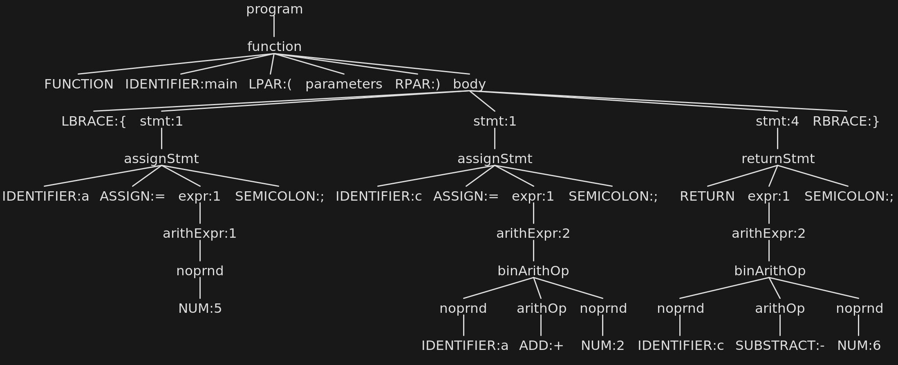
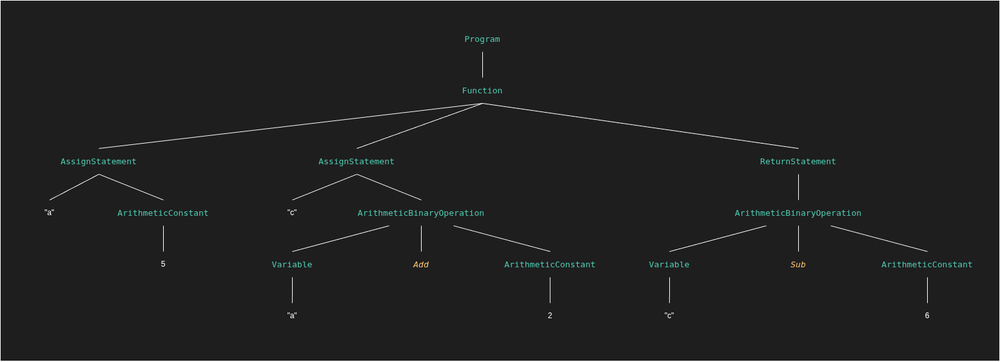

# INFOM227 ExampleAnalyser

The aim of this project is to provide an example of a static code analyser and to remind people of the basics of creating languages.

The analyser has been implemented in [Scala](https://www.scala-lang.org/) for several reasons:

- Scala natively supports Java libraries, including [ANTLR](https://www.antlr.org/), which is one of the best-known libraries for writing programming languages.
- Scala supports [Algebraic data type](https://en.wikipedia.org/wiki/Algebraic_data_type) and has powerful [Pattern matching](https://en.wikipedia.org/wiki/Pattern_matching) capabilities, which makes it very easy to define a language and perform analysis on it.
- It provides a very good developer experience because there is a built-in [Gradle plugin for Scala](https://docs.gradle.org/current/userguide/scala_plugin.html) and [Gradle plugin for ANTLR](https://docs.gradle.org/current/userguide/antlr_plugin.html).
- Scala can treat [errors as values](https://en.wikipedia.org/wiki/Result_type) using [Monads](https://en.wikipedia.org/wiki/Monad_(functional_programming)) ([Here is a great video on the subject](https://www.youtube.com/watch?v=C2w45qRc3aU)), and this highlights the edge cases in the analyses.


## Requirements

The application requires:

- [Java](https://adoptium.net/) >= 23


## Download

You can download the application on the [downloads page](https://github.com/UNamurCSFaculty/INFOM227_ExampleAnalyser/releases).


## Execution

You can execute a program using the application by running the following command:

```bash
java -jar Small-X.X.X-all.jar run <path-to-your-program>
```

You can run a zero analysis on a program using the application by running the following command:

```bash
java -jar Small-X.X.X-all.jar zero-analysis <path-to-your-program>
```


## Setting up a development environment

### Requirements

The application requires:

- [Jdk](https://adoptium.net/) >= 23


### Installation & Build

You can install the project using [Gradle](https://gradle.org/) and build the application with the following commands:

#### Windows

```bat
./gradlew.bat build
```

#### Linux & MacOS

```bash
./gradlew build
```

The application will be built in the `build/libs/Small-X.X.X-all.jar` file.


### Tests

You can run the tests of the project using [Gradle](https://gradle.org/) with the following commands:

#### Windows

```bat
./gradlew.bat test
```

#### Linux & MacOS

```bash
./gradlew test
```


## Syntax

The syntax of a programming language determines what constitutes a valid program in terms of text. In almost all cases for programming languages, this syntax is defined using a [Context-free grammar](https://en.wikipedia.org/wiki/Context-free_grammar). In the course and in this example, the grammars are defined formally using the [EBNF (extended Backus-Naur form)](https://en.wikipedia.org/wiki/Extended_Backus–Naur_form) notation.


### Grammar

In this example, we will use the following grammar to define the syntax of our language:

$$
\begin{align}
& \langle program \rangle ::= \, \langle function \rangle* \\
& \langle function \rangle ::= \, 'function' \quad \langle identifier \rangle '(' \langle parameters \rangle ')' \quad \langle body \rangle \\
& \langle parameters \rangle ::= \, [\, \langle identifier \rangle (',' \, \langle identifier \rangle)* \, ] \\
& \langle body \rangle ::= \, '\{' \langle stmt \rangle* '\}' \\
& \langle stmt \rangle ::= \, \langle assignStmt \rangle \, | \, \langle ifStmt \rangle \, | \, \langle whileStmt \rangle \, | \, \langle returnStmt \rangle \\
& \langle assignStmt \rangle ::= \, \langle identifier \rangle \, '=' \, (\langle expr \rangle | \langle funcCall \rangle) ';' \\
& \langle ifStmt \rangle ::= \, 'if' \quad '(' \langle boolExpr \rangle ')' \quad \langle body \rangle \quad 'else' \quad \langle body \rangle \\
& \langle whileStmt \rangle ::= \, 'while' \quad '(' \langle boolExpr \rangle ')' \quad \langle body \rangle \\
& \langle returnStmt \rangle ::= \, 'return' \quad \langle expr \rangle ';' \\
& \langle arguments \rangle ::= \, [\, \langle expr \rangle (',' \, \langle expr \rangle)* \, ] \\
& \langle funcCall \rangle ::= \, \langle identifier \rangle '(' \langle arguments \rangle ')' \\
& \langle expr \rangle ::= \, \langle arithExpr \rangle \, | \, \langle boolExpr \rangle \\
& \langle arithExpr \rangle ::= \, \langle noprnd \rangle \, | \, \langle binArithOp \rangle \\
& \langle boolExpr \rangle ::= \, \langle boprnd \rangle \, | \, \langle relOp \rangle \, | \, \langle binLogicOp \rangle \\
& \langle binArithOp \rangle ::= \, \langle noprnd \rangle \, \langle arithOp \rangle \, \langle noprnd \rangle \\
& \langle binLogicOp \rangle ::= \, \langle noprnd \rangle \, \langle logicOp \rangle \, \langle noprnd \rangle \\
& \langle relOp \rangle ::= \, \langle boprnd \rangle \, \langle nop \rangle \, \langle boprnd \rangle \\
& \langle noprnd \rangle ::= \, \langle identifier \rangle \, | \, \langle num \rangle \\
& \langle boprnd \rangle ::= \, \langle identifier \rangle \, | \, 'True' \, | \, 'False' \\
& \langle arithOp \rangle ::= \, '+'\, | \,'-'\, | \,'*'\, | \,'/' \\
& \langle logicOp \rangle ::= \, '<'\, | \,'>'\, | \,'=='\, | \,'!='\, | \,'>='\, | \,'<=' \\
& \langle nop \rangle ::= \, '=='\, | \,'!='\, | \,'and'\, | \,'or' \\
& \langle digit \rangle ::= \, '0'\, | \,'1'\, | \,'2'\, | \,'3'\, | \,'4'\, | \,'5'\, | \,'6'\, | \,'7'\, | \,'8'\, | \,'9' \\
& \langle num \rangle ::= \, \langle digit \rangle+ \\
& \langle letter \rangle ::= \, 'a'\, | \,'b'\, | \,'c'\, | \,\ldots\, | \,'z'\, | \,'A'\, | \,'B'\, | \,'C'\, | \,\ldots\, | \,'Z' \\
& \langle identifier \rangle ::= \, \langle letter \rangle (\langle letter \rangle\, | \,\langle digit \rangle)*
\end{align}
$$

By using this grammar, it is possible to check whether a text follows a certain format and therefore to verify the syntax of the programming language we want. However, this grammar cannot be directly converted into code that automatically checks whether text follows the syntax of our language. This is why we usually use tools such as ANTLR to do this for us. Even if this involves rewriting the syntax in a format that the tool supports, the use of ANTLR saves a lot of time by creating code that can recognise a language automatically. You can find the grammar described above in the format supported by ANTLR if you go [there](src/main/antlr/be/unamur/info/infom227/small/cst/SmallGrammar.g4). If you open it, you'll see that it looks very similar to our grammar using the format the EBNF notation. The main difference is that the file is divided into 2 parts, the [Lexer](https://en.wikipedia.org/wiki/Lexical_analysis) part and the [Parser](https://en.wikipedia.org/wiki/Parsing) part. The lexer is responsible for converting text into words and removing unnecessary characters. **The order of the rules written here is important because the lexer will use the first rule that matches the text to create the words.** This is why the keywords are above the identifiers. Without this, ANTLR would not be able to properly find the keywords. Then, there is the parser which is responsible for converting the sequence of words created by the lexer into a [CST (Concrete Syntax Tree)](https://en.wikipedia.org/wiki/Parse_tree). This CST uses the [Visitor design pattern](https://en.wikipedia.org/wiki/Visitor_pattern), which makes it easy to browse for the information we want.


### Concrete Syntax Tree

Here is an example of how some code can be converted into a CST using ANTLR and our grammar:

```
function main() {
    a = 5;
    c = a + 2;
    return c - 6;
}
```



As you can see, with just 5 lines of code, this already represents a fairly large CST (If you are interested, this CST was generated using the [ANTLR extension for IntelliJ](https://plugins.jetbrains.com/plugin/7358-antlr-v4)). Usually, the branches of expressions are much longer because they are designed to follow the [Order of operations](https://en.wikipedia.org/wiki/Order_of_operations#Programming_languages) directly at the syntax level and this is something that can be found in almost all programming languages ([Example with the Python grammar](https://docs.python.org/3/reference/grammar.html)). However, since the operations in Small cannot be nested, this does not affect us.


## Semantics

Once the syntactic analysis has been performed using ANTLR, it is then possible to perform a [Semantic](https://en.wikipedia.org/wiki/Semantics_(computer_science)) analysis. The semantics of a programming language define what has a meaning, i.e. which operations make sense and which don't, what happens when an instruction is executed, and so on. Indeed, does it make sense to divide a boolean variable by 2 given that the syntax allows it? In the case of our language, we would rather display an error to the user to indicate that it doesn't make sense because there is a mismatch between the type of the variable and the type of the expression. That's why we need to formally define the semantics of our language.


### Semantic rules

The semantics of our language are defined by the [operational semantics](https://en.wikipedia.org/wiki/Operational_semantics) below that use some [rules of inference](https://en.wikipedia.org/wiki/Rule_of_inference):

$$
\begin{align}
\text{[True]} & \quad \frac{}{(\mathtt{True},\sigma) \leadsto \mathtt{True}} \\
\text{[False]} & \quad \frac{}{(\mathtt{False},\sigma) \leadsto \mathtt{False}} \\
\text{[Int]} &  \quad \frac{v\in\mathbb{Z}}{(v,\sigma) \leadsto v} \\
\text{[Var]} & \quad \frac{x\in\mathtt{< Var >}}{(x,\sigma) \leadsto \sigma(x)} \\
\text{[Op]} & \quad \frac{(x_1,\sigma) \leadsto v_1 \quad (x_2,\sigma) \leadsto v_2 \quad v_1 \oplus v_2 = v}{(x_1\oplus x_2,\sigma) \leadsto v} \\
\text{[Sequence]} & \quad \frac{(s_1,\Sigma\bullet\sigma) \leadsto (\bot, \Sigma\bullet\sigma') \quad (s_2,\Sigma\bullet\sigma') \leadsto (v, \Sigma\bullet\sigma'')}{(s_1 \mathtt{;} s_2, \Sigma\bullet\sigma) \leadsto (v, \Sigma\bullet\sigma'')} \\
\text{[Early return]} & \quad \frac{v \in \mathbb{Z} \cup \{\mathtt{True}, \mathtt{False}\} \quad (s_1,\Sigma\bullet\sigma) \leadsto (v, \Sigma\bullet\sigma')}{(s_1 \mathtt{;} s_2, \Sigma\bullet\sigma) \leadsto (v, \Sigma\bullet\sigma')} \\
\text{[Simple assignment]} & \quad \frac{(e,\sigma) \leadsto v \quad \sigma' = \sigma[x\mapsto v]}{(x \: \mathtt{=} \: e, \Sigma\bullet\sigma) \leadsto (\bot, \Sigma\bullet\sigma')} \\
\text{[If-True]} & \quad \frac{(e,\sigma) \leadsto \mathtt{True}\quad (s_1,\Sigma\bullet\sigma) \leadsto (v, \Sigma\bullet\sigma')}{(\mathtt{if}\: (e)\: s_1\: \mathtt{else}\: s_2, \Sigma\bullet\sigma) \leadsto (v, \Sigma\bullet\sigma')} \\
\text{[If-False]} & \quad \frac{(e,\sigma) \leadsto \mathtt{False}\quad (s_2,\Sigma\bullet\sigma) \leadsto (v, \Sigma\bullet\sigma')}{(\mathtt{if}\: (e)\: s_1\: \mathtt{else}\: s_2, \Sigma\bullet\sigma) \leadsto (v, \Sigma\bullet\sigma')} \\
\text{[While-True]} & \quad \frac{(e,\sigma) \leadsto \mathtt{True}\quad (s;\mathtt{while}\:(e)\:s, \Sigma\bullet\sigma) \leadsto (v, \Sigma\bullet\sigma')}{(\mathtt{while}\:(e)\:s, \Sigma\bullet\sigma) \leadsto (v, \Sigma\bullet\sigma')} \\
\text{[While-False]} & \quad  \frac{(e,\sigma) \leadsto \mathtt{False}}{(\mathtt{while}\:(e)\:s, \Sigma\bullet\sigma) \leadsto (\bot, \Sigma\bullet\sigma)} \\
\text{[Return]} & \quad \frac{(e,\sigma) \leadsto v}{(\mathtt{return}\: e, \Sigma\bullet\sigma) \leadsto (v, \Sigma)} \\
\text{[Function call]} & \quad \frac{
\begin{aligned}
  \left(
  \substack{
    \displaystyle (e_1,\sigma) \leadsto a_1 \\\\
    \displaystyle \ldots \\\\
    \displaystyle (e_n,\sigma) \leadsto a_n
  }
  \right)
  \quad
  \sigma_n &= \left\{
  \substack{
    \displaystyle x_1 \mapsto a_1, \\\\
    \displaystyle \ldots \\\\
    \displaystyle x_n \mapsto a_n
  }
  \right\}
  \quad
  (B,\Sigma\bullet\sigma\bullet\sigma_n) \leadsto (v,\Sigma\bullet\sigma)
\end{aligned}
}{(y \: \mathtt{=} \: f(e_1, \ldots, e_n), \Sigma\bullet\sigma) \leadsto (\bot, \Sigma\bullet\sigma[y\mapsto v])} \\
& \mbox{where $n \geq 0$ and $f$ is defined as}\:\mathtt{function}\: f(x_1,\ldots,x_n) \{B\} \\
\end{align}
$$

with:

- The notation $< Var >$ corresponds to the set of variables in the program.
- The symbol $\oplus$ corresponds to the operators `+`, `-`, `*`, `/`, `<`, `>`, `<=`, `>=`, `!=`, `==`, `and` and `or` with their mathematical semantics.
- The symbol $\mathcal{E}$ corresponds to the set of all possible environments.
- The symbol $\sigma$, with $\sigma \in \mathcal{E}$ and $\sigma : < Var > \mapsto \mathbb{Z} \cup \{True, False\}$, corresponds to the environment of the function currently being executed.
- The symbol $\Sigma$, with $\Sigma = \langle \sigma_0, ..., \sigma_n \rangle$, corresponds to the execution stack which is a sequence of environments.
- The notation $\Sigma \bullet \sigma$ splits the execution stack into the environment of the function currently being executed $\sigma$ and the rest of the execution stack $\Sigma$.
- The notation $(e, \Sigma \bullet \sigma) \leadsto v$ corresponds to the evaluation of an expression $e$ with respect to an environment $\sigma$ and the rest of the execution stack $\Sigma$ and which produces $v$ as a value.
- The notation $\sigma[x \mapsto v]$ corresponds to the update of the environment $\sigma$ with the fact that $v$ is associated to $x$.
- The notation $(I, \Sigma \bullet \sigma) \leadsto (v, \Sigma \bullet \sigma')$ corresponds to the fact of executing an instruction $I$ with respect to a state $\Sigma \bullet \sigma$ and yielding a return value $v$ and a state $\Sigma \bullet \sigma'$.

With these semantic rules, it is now possible to perform our semantic analysis. In untyped languages such as the one considered here, this is primarily handled at runtime. However, certain properties can still be checked statically, such as ensuring that no two functions share the same name using the Visitor design pattern and the CST defined earlier. When that happens, an error is produced in the visitor and then displayed to the programmer. In general, it is also during this step that we try to simplify our CST into an [AST (Abstract Syntax Tree)](https://en.wikipedia.org/wiki/Abstract_syntax_tree) that allows us to keep only the information we need and to create a set of data structures that are easier to use in the rest of our application. The code that performs the semantic analysis and creates the AST can be found [here](src/main/scala/be/unamur/info/infom227/small/ast/Builder.scala). Note that in typed languages, it is usually a good idea to have a [Symbol table](https://en.wikipedia.org/wiki/Symbol_table) to store the variables that have been defined and their type, but it is not useful in our case.

### Abstract Syntax Tree

In our implementation, the AST is defined using Scala classes that allow easy pattern matching of the nodes. Here is what the AST looks like after being built from the CST mentioned above:




## Interpreter

With our AST and our visitors, it's very easy to create an interpreter for our language that will follow the semantics defined earlier. All we need to do is create [a class that will represent the environment](src/main/scala/be/unamur/info/infom227/interpreter/ExampleEnvironment.scala) and then [implement the different rules](src/main/scala/be/unamur/info/infom227/interpreter/ExampleInterpreter.scala) using our visitors.


## Zero Analysis

In this section, we will define a Zero Analysis, similar to the one used in the course, by using the Worklist algorithm implemented [here](src/main/scala/be/unamur/info/infom227/analysis/ExampleWorklist.scala). The file containing the entire analysis code is available [here](src/main/scala/be/unamur/info/infom227/analysis/ExampleZeroAnalysis.scala).


### Abstract values & Lattice

First, we need to define the set of abstract values $L$ that we are going to use, and the lattice that is used to order these values:

$$
L = \{Bottom, Z, NZ, U\}
$$

with:

- $Bottom$ representing the fact that there is no value assigned yet.
- $Z$ representing zero.
- $NZ$ representing any value different from zero
- $U$ representing the fact
  that it is not known whether the value is zero or different from zero.


### Control-flow graph

Next, we need to convert our AST into a [CFG (Control-flow graph)](https://en.wikipedia.org/wiki/Control-flow_graph). The code that achieves this can be found [here](src/main/scala/be/unamur/info/infom227/cfg/ExampleCfgBuilder.scala).

A CFG is composed of the following elements:

- $PRED(p)$ : A function which returns the predecessors of the program point $p$.
- $SUCC(p)$ : A function which returns the successors of the program point $p$.
- $COND(p, p')$ : A function which returns a boolean expression that must be $True$ to go from the program point $p$ to the program point $p'$.

### Abstract environment & Control-flow function

After that, we can define our abstract environment:

$$
\phi: < Var > \mapsto L
$$

with:

- The notation $< Var >$ corresponds to the set of variables in the program.

Next, we can define our control-flow function by specifying its instances:

$$
\begin{align}
& fg [[ p ]] (\phi) = & \phi[x \mapsto Z] & \quad if & P[p] \equiv int\ x & \\
& & \phi[x \mapsto NZ] & \quad if & P[p] \equiv bool\ x & \\
& & f [[ P[p] ]] (\phi) & \quad if & P[p] \equiv x = E & \\
& & \phi[x \mapsto U] & \quad if & P[p] \equiv x = \{S; E\} & \\
& & \phi & \quad if & P[p] \equiv while (E) \lor P[p] \equiv if (E) \lor P[p] \equiv print \ E  & \\
\end{align}
$$

with:

$$
\begin{align}
& f [[ x = 0 ]] (\phi) = & \phi[x \mapsto Z] & & & \\
& f [[ x = c ]] (\phi) = & \phi[x \mapsto NZ] & \quad if & c \in \mathbb{Z}_0 \cup \{True, False\} & \\
& f [[ x = y ]] (\phi) = & \phi[x \mapsto \phi(y)] & \quad if & y \in < Var > & \\
& f [[ x = c + d ]] (\phi) = & \phi[x \mapsto Z] & \quad if & c = -d & \\
& & \phi[x \mapsto U] & \quad otherwise & & \\
& f [[ x = y + z ]] (\phi) = & \phi[x \mapsto Z] & \quad if & \phi(y) = \phi(z) = Z & \\
& & \phi[x \mapsto U] & \quad otherwise & & \\
& f [[ x = y + c ]] (\phi) = & \phi[x \mapsto Z] & \quad if & \phi(y) = Z \wedge c = 0 & \\
& & \phi[x \mapsto NZ] & \quad if & \phi(y) = Z \wedge c \neq 0 & \\
& & \phi[x \mapsto NZ] & \quad if & \phi(y) = NZ \wedge c = 0 & \\
& & \phi[x \mapsto U] & \quad otherwise & & \\
& f [[ x = c + y ]] (\phi) = & f [[ x = y + c ]] (\phi) & & & \\
& f [[ x = y \oplus z ]] (\phi) = & \phi[x \mapsto U] & \quad if & \oplus \neq + & \\
\end{align}
$$

These control-flow function instances are almost the same as the ones in the course. It was a choice to make them not that precise.


### Condition update function

Moreover, the Worklist algorithm also requires a function to update the abstract environments according to the boolean expressions in the $COND(p, p')$ function.

Here are the function instances that we will use in our analysis:

$$
\begin{align}
& cg[[ False ]] (\phi) = & \bot & & \\
& cg[[ y < c ]] (\phi) = & \phi[y \mapsto NZ] & \quad if & c \leq 0 \wedge \phi(y) = \bot & \\
& & \phi[y \mapsto \phi(y) \sqcap NZ] & \quad if & c \leq 0 \wedge \phi(y) \neq \bot \wedge \phi(y) \sqcap NZ \neq \bot & \\
& & \phi[y \mapsto U] & \quad if & c > 0 \wedge \phi(y) = \bot & \\
& & \phi[y \mapsto \phi(y) \sqcap U] & \quad if & c > 0 \wedge \phi(y) \neq \bot \wedge \phi(y) \sqcap U \neq \bot & \\
& & \bot & \quad otherwise & & \\
& cg[[ c < y ]] (\phi) = & cg[[ y > c ]] (\phi) & & & \\
& cg[[ y > c ]] (\phi) = & \phi[y \mapsto NZ] & \quad if & c \geq 0 \wedge \phi(y) = \bot & \\
& & \phi[y \mapsto \phi(y) \sqcap NZ] & \quad if & c \geq 0 \wedge \phi(y) \neq \bot \wedge \phi(y) \sqcap NZ \neq \bot & \\
& & \phi[y \mapsto U] & \quad if & c < 0 \wedge \phi(y) = \bot & \\
& & \phi[y \mapsto \phi(y) \sqcap U] & \quad if & c < 0 \wedge \phi(y) \neq \bot \wedge \phi(y) \sqcap U \neq \bot & \\
& & \bot & \quad otherwise & & \\
& cg[[ c > y ]] (\phi) = & cg[[ y < c ]] (\phi) & & & \\
& cg[[ y <= c ]] (\phi) = & \phi[y \mapsto NZ] & \quad if & c < 0 \wedge \phi(y) = \bot & \\
& & \phi[y \mapsto \phi(y) \sqcap NZ] & \quad if & c < 0 \wedge \phi(y) \neq \bot \wedge \phi(y) \sqcap NZ \neq \bot & \\
& & \phi[y \mapsto U] & \quad if & c \geq 0 \wedge \phi(y) = \bot & \\
& & \phi[y \mapsto \phi(y) \sqcap U] & \quad if & c \geq 0 \wedge \phi(y) \neq \bot \wedge \phi(y) \sqcap U \neq \bot & \\
& & \bot & \quad otherwise & & \\
& cg[[ c <= y ]] (\phi) = & cg[[ y >= c ]] (\phi) & & & \\
& cg[[ y >= c ]] (\phi) = & \phi[y \mapsto NZ] & \quad if & c > 0 \wedge \phi(y) = \bot & \\
& & \phi[y \mapsto \phi(y) \sqcap NZ] & \quad if & c > 0 \wedge \phi(y) \neq \bot \wedge \phi(y) \sqcap NZ \neq \bot & \\
& & \phi[y \mapsto U] & \quad if & c \leq 0 \wedge \phi(y) = \bot & \\
& & \phi[y \mapsto \phi(y) \sqcap U] & \quad if & c \leq 0 \wedge \phi(y) \neq \bot \wedge \phi(y) \sqcap U \neq \bot & \\
& & \bot & \quad otherwise & & \\
& cg[[ c >= y ]] (\phi) = & cg[[ y <= c ]] (\phi) & & & \\
& cg[[ y == c ]] (\phi) = & \phi[y \mapsto Z] & \quad if & c = 0 \wedge \phi(y) = \bot & \\
& & \phi[y \mapsto \phi(y) \sqcap Z] & \quad if & c = 0 \wedge \phi(y) \neq \bot \wedge \phi(y) \sqcap Z \neq \bot & \\
& & \phi[y \mapsto NZ] & \quad if & c \neq 0 \wedge \phi(y) = \bot & \\
& & \phi[y \mapsto \phi(y) \sqcap NZ] & \quad if & c \neq 0 \wedge \phi(y) \neq \bot \wedge \phi(y) \sqcap NZ \neq \bot & \\
& & \bot & \quad otherwise & & \\
& cg[[ c == y ]] (\phi) = & cg[[ y == c ]] (\phi) & & & \\
& cg[[ y\ != c ]] (\phi) = & \phi[y \mapsto NZ] & \quad if & c = 0 \wedge \phi(y) = \bot & \\
& & \phi[y \mapsto \phi(y) \sqcap NZ] & \quad if & c = 0 \wedge \phi(y) \neq \bot \wedge \phi(y) \sqcap NZ \neq \bot & \\
& & \phi[y \mapsto U] & \quad if & c \neq 0 \wedge \phi(y) = \bot & \\
& & \phi[y \mapsto \phi(y) \sqcap U] & \quad if & c \neq 0 \wedge \phi(y) \neq \bot \wedge \phi(y) \sqcap U \neq \bot & \\
& & \bot & \quad otherwise & & \\
& cg[[ c\ != y ]] (\phi) = & cg[[ y\ != c ]] (\phi) & & & \\
& cg[[ E ]] (\phi) = & \phi & \quad if & \text{E is not defined in the other instances} & \\
\end{align}
$$

In addition, the $cg$ function can also be written as follows:

$$
\begin{align}
& \phi [ COND(p, p') ] = cg[[ COND(p, p') ]] (\phi) & \\
\end{align}
$$

### Results interpretation

Finally, we can define processing rules in order to interpret the results of the analysis:

| *Line (PP)* | *Instruction (I)* | *Condition (C)* | *Type (T)* | *Message (M)*                 |
|-------------|-------------------|-----------------|------------|-------------------------------|
| p           | x = y / z         | $\phi_p(z) = Z$ | Error      | "Division by zero detected !" |
| p           | x = y / z         | $\phi_p(z) = Z$ | Warning    | "Possible division by zero !" |

These rules are the same as the ones in the course.
